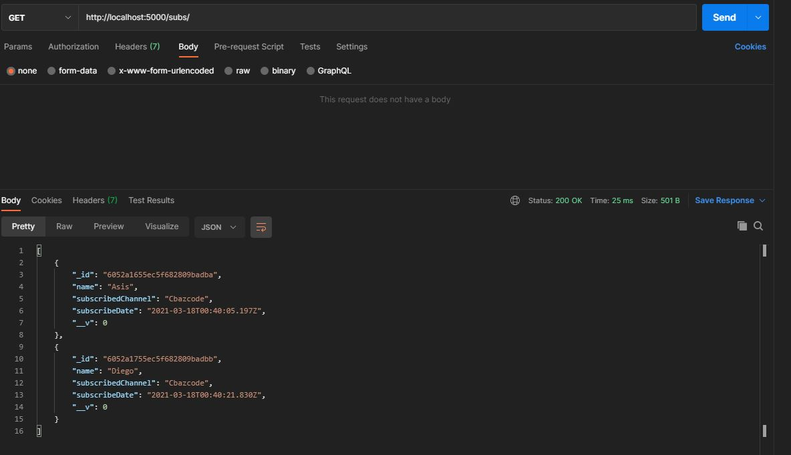

# REST API Sencilla

- Api sencilla desarrollada en Nodejs(Express) con ES7 con modulos: dotenv, mongoose
- Base de datos: MongoDB

## URL : http://localhost:5000/subs/



Para instalar aplicación ejecutar:

```
npm install
```

Para iniciar aplicación ejecutar

```
npm run dev
```

------

Utilización:

```bash
#POST hacia http://localhost:5000/subs/
{
    "name":"name",
    "subscribedChannel":"youtubechannel"
}
#GET hacia http://localhost:5000/subs/:id
#PATCH hacia http://localhost:5000/subs/:id (con body similar a POST)
#DELETE http://localhost:5000/subs/:id

# Retornara un JSON
{
        "_id": "6052a1655ec5f682809badba",
        "name": "name",
        "subscribedChannel": "youtubechannel",
        "subscribeDate": "2021-0x-18T00:40:05.197Z",
        "__v": 0
}

```

